# **Clients Profile**

Clients Profile is a Python terminal App that runs on Heroku. 

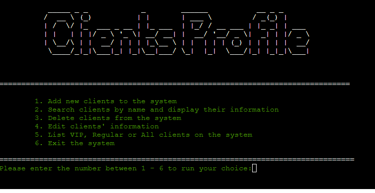

As a data management system, it is supposed to help user to easily access and manipulate data to provide efficiency to their work. The targeted users are sales person, account managers and whoever managing a large client base. With Clients Profile App, they can now add, delete, search, edit and view clients through the interactive terminal with any device. Furthermore, when each time user updating a new sale, the system will automatically review the client's status and change it accordingly.
A live project can be viewed [Here](https://client-profile-system.herokuapp.com/).

## How To Operate

Clients Profile App is easy to operate. Users will start with a menu of 6 options. They can choose any given option by entering 1 to 6 to run the specific program to manage the client database. 

After each selection of the options, users only need to follow the computer instruction for each step to complete the task. 

At the end of each program, it will go back to the main menu and ready to run another program chosen by users. If users finish what they need to do, simply enter 6 at main menu and exit the Clients Profile system.

## User Experience (UX)

### User Stories

As a sales person or account manager, users would like to have an easy access to client database:
* Simple platform and smooth operation
* Clear instruction and easy to follow
* Easy to allocate the information needed
* Easy to add and delete clients and update their details 
* Automatically calculate the total spend for each client 
* Automatically classify the clients into the appropriate group when certain criteria is reached.

### Site Goal
* This App was designed based on user stores to provide the best dynamic experience. 
* Further efforts were made to eliminate user input 'value error' which may interrupt normal programming.
* User Inputs are designed **Not** case-sensitive. No matter what case users input, it won't affect the comparison result. 
* Colored text and formated data improved site readability and user friendly interface. 

## Features

**App Title and Main Menu:**
* [Pyfiglet](https://pypi.org/project/pyfiglet/0.7/) was installed and imported to generate ASCII art for App Title.

* For the sake of it's large font size and simple style, Doom Font was used to the title. It was centred to prominent it's professionalism and clean layout.

* Green colored operation menu is right underneath the App title. 
* Number listed operation options are clearly specified in short words.
* A friendly message instructs the user to start the program.

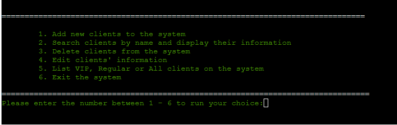

* If users didn't enter what required by instruction message (eg: anything rather than number 1 - 6), an error message with read background appears.
* Users will be asked to enter again until a number representing one of the menu options is entered.

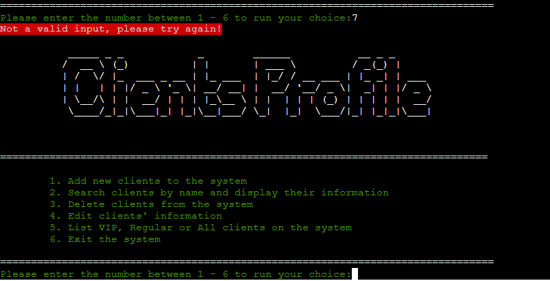

**Operation option 1 - Add New Client:**
* If users enter *1* to add a new client, App will ask users to provide information of client's first name, last name and date of birth. 
* Those unique information are used to identify if the person entered is already a client. 
* If **Not** in the system, then further personal information are asked to build the client profile. (eg: contact number, email and spend)
* When enter the spend amount, a number is required, otherwise an error message appears until a number is entered.
* Then the entered spend is viewed. If it is more than 35k, this new client is classified as VIP, otherwise Regular in status.
* After confirmation of adding the client to the system, main menu is loaded again for next operation.

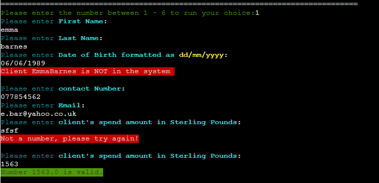
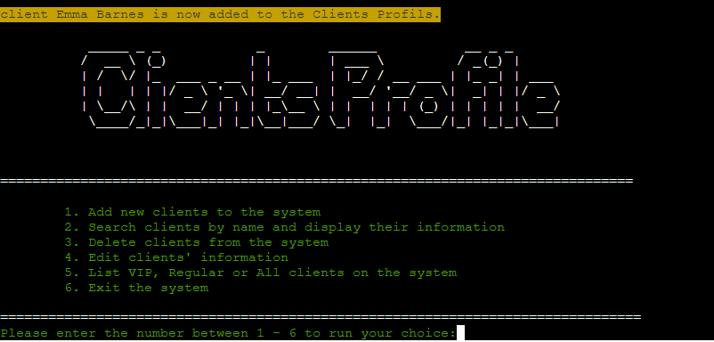

* If the person entered is already in the system, an message highlighted in red informs user the result.
* Main menu is loaded again and ready for next operation.

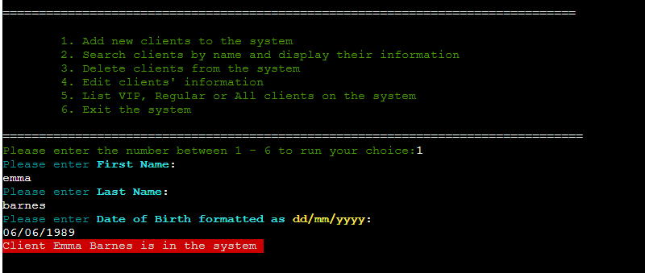

**Operation option 2 - Search Client:**
* If users enter *2* to search a client to get his/her details, App will ask users to provide information of client's first name and last name.
* If the name is found, a table containing the client(s)' details is displayed.
* [Tabulate](https://pypi.org/project/tabulate/) was installed and imported to format python list into nice table. This feature improves users' visual experience.
* It is very useful when users want to access a client's information for certain purpose. (eg. get the contact details, check total spend or client status)
* It also can be used to find the date of birth, before users delete client or edit a client's detail. 
* If there are multiple clients having a same name, all of them will be listed in the table.

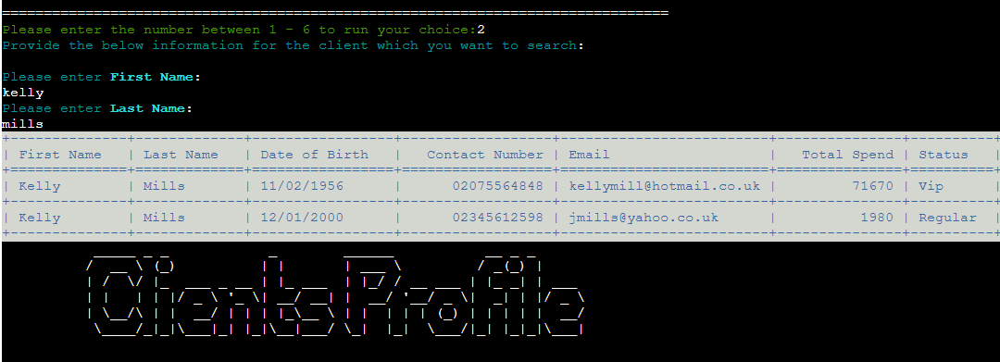

* If client not found in the system, a message highlighted in red would inform the result to users.
* Then an empty table with headers only is displayed. And main menu is loaded for next operation.

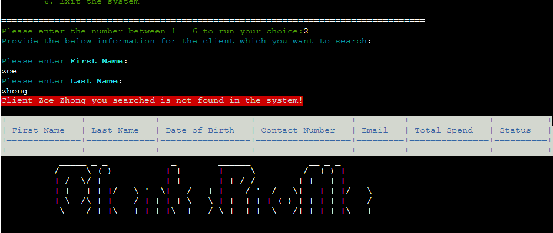

**Operation option 3 - Delete Client:**
* If users enter *3* to delete a client, App will ask users to provide information of client's first name, last name and date of birth in order to allocate the particular client.
* After finding the client, system will ask user if they want to delete this client (Y or N). 
* If users enter 'N', App will confirm the decision and exit to main menu.

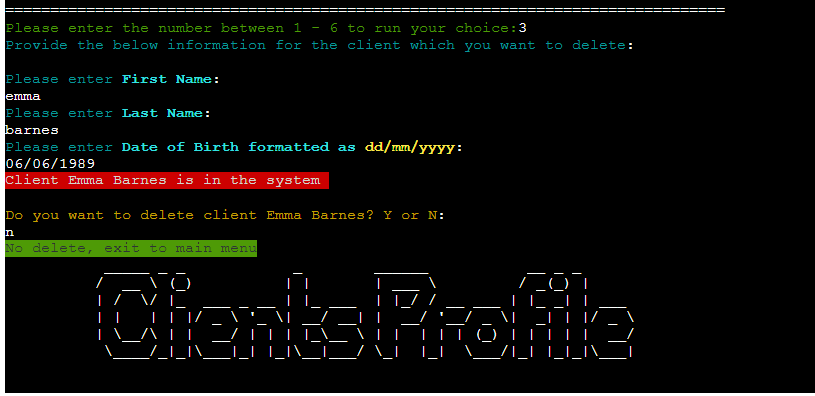

* If users enter 'Y', App will confirm the client is deleted.
* Main menu is then loaded for next operation.

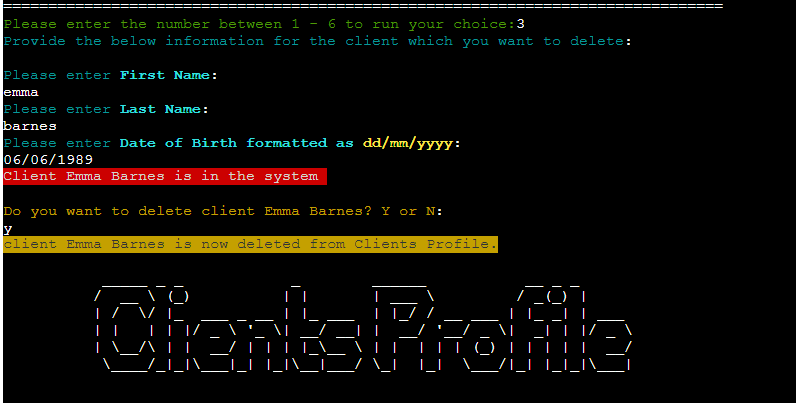

* If the person entered is not found, then system will inform users the result.
* Main menu is then loaded for next operation.

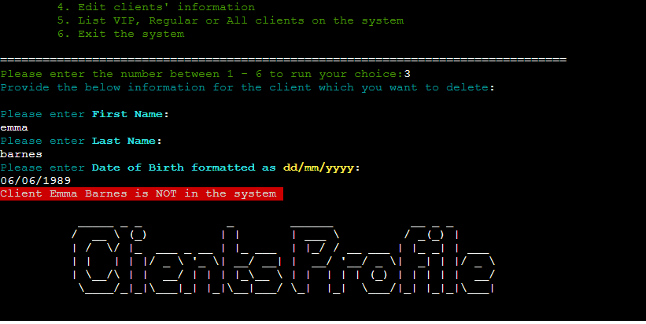

**Operation option 4 - Edit Client:**
* If users enter *4* to edit a client's detail, App will ask users to provide information of client's first name, last name and date of birth in order to allocate the particular client.
* After finding the client, system will ask user if they want to edit each personal information one after each other (Y or N). 
* If users enter 'N' for one of the updating options, it will then move to next one.
* Spend is the last option and if no edit, system will exit to main menu for next operation.

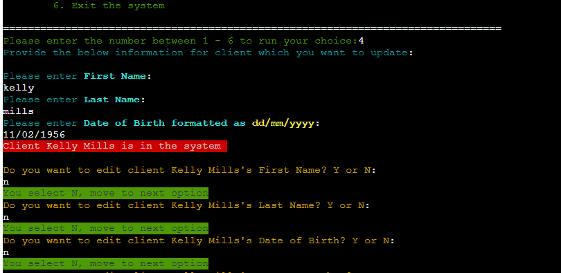
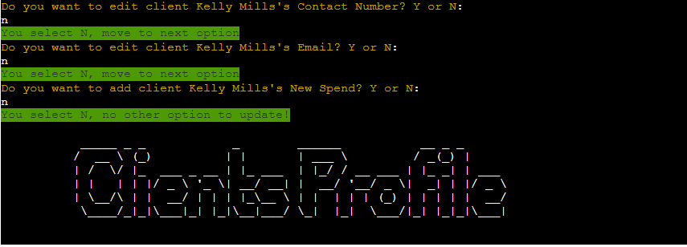

* For each option of updating, if users enter 'Y', App will confirm the updated value and move to next option.
* When editing spend, number is required. Otherwise a error message highlighted in red appears until a valid number is entered.
* After a spend is entered, system would add it to the current total spend for a new total spend. And Client's status will be reviewed and updated if necessary.
* Then App will display a statement with the reviewed/updated status and new total spend.
* After the last option is updated, App exits to main menu for next operation.

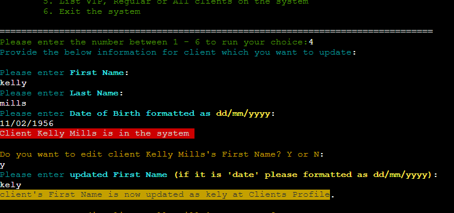
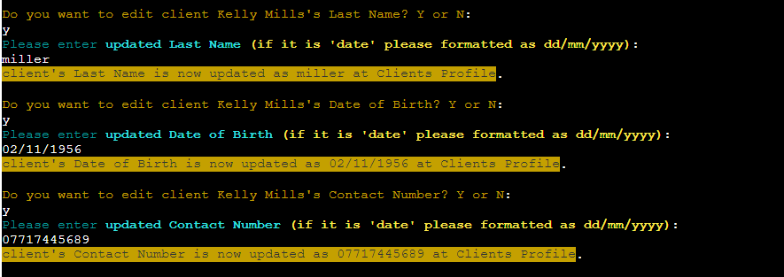
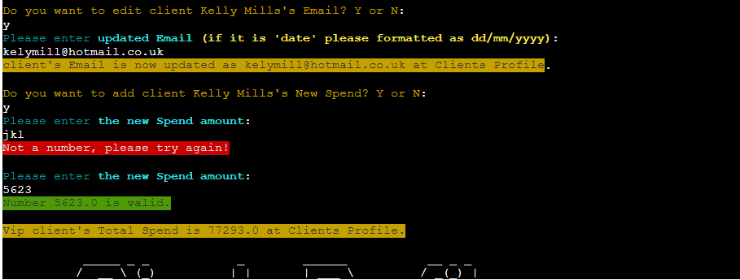

* If the person entered is not found in the system, App will inform users and exit to main menu.
 
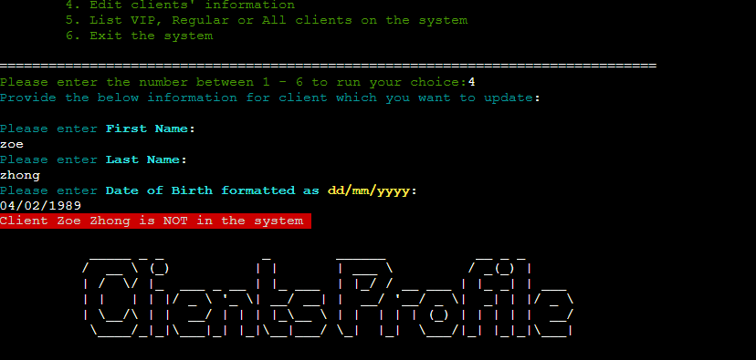

**Operation option 5 - Client List:**
* If users enter *5* to list group clients, App will provide options of VIP, Regular or All clients.
* After display the required table, App exit to main menu for user to choose next operation.

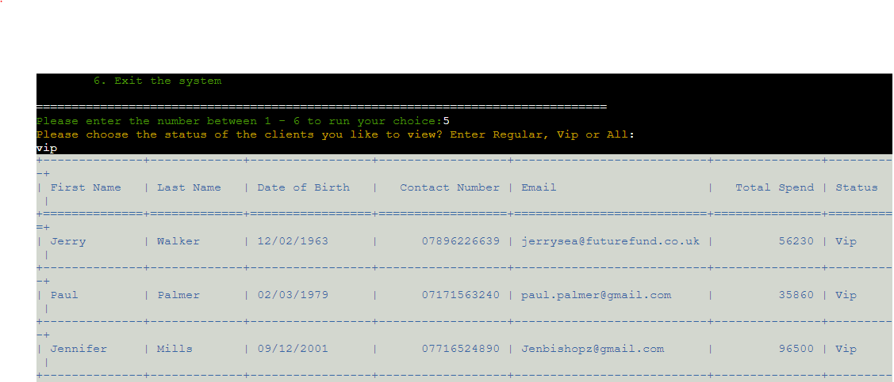
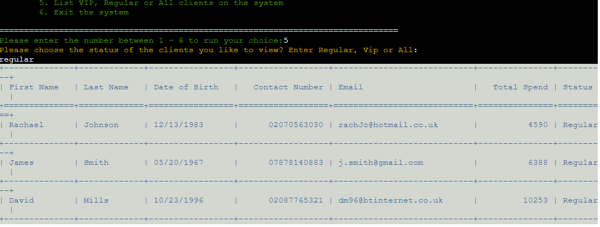  
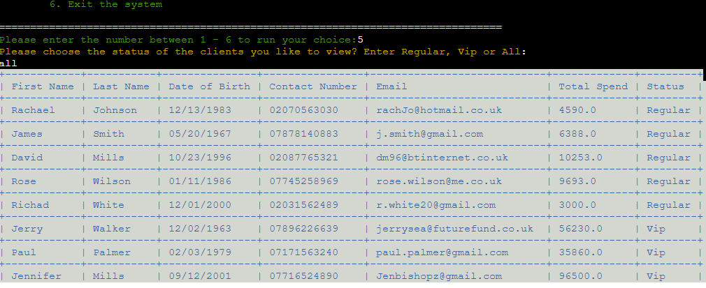 

**Operation option 6 - Exit Clients Profile system:**
* Users can enter *6* to exit Clients Profile system.
* A thank you message printed to confirm the exit.

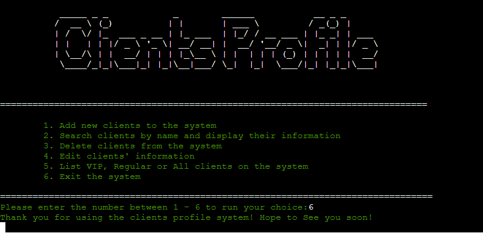

