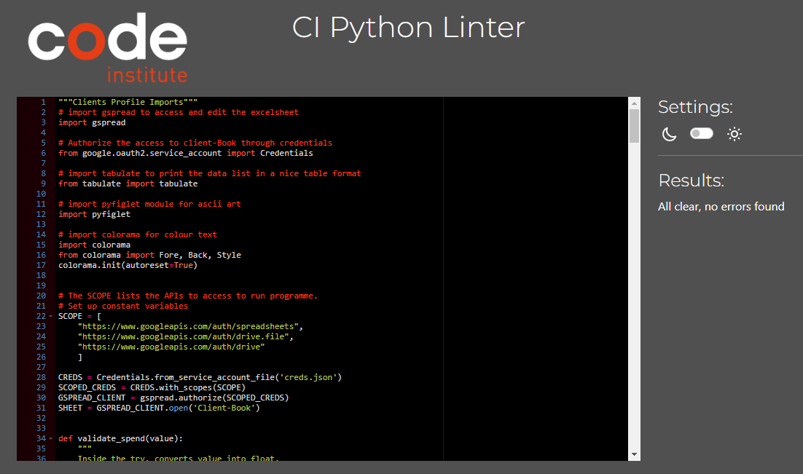

# **Clients Profile**

Clients Profile is a Python terminal App that runs on Heroku. 

As a data management system, it is supposed to help user to easily access and manipulate data to provide efficiency to their work. The targeted users are sales person, account managers and whoever managing a large client base. With Clients Profile App, they can now add, delete, search, edit and view clients through the interactive terminal with any device. Furthermore, when each time user updating a new sale, the system will automatically review the client's status and change it accordingly.
A live project can be viewed [Here](https://client-profile-system.herokuapp.com/).

## How To Operate

Clients Profile App is easy to operate. Users will start with a menu of 6 options. They can choose any given option by entering 1 to 6 to run the specific program to manage the client database. 

After each selection of the options, users only need to follow the computer instruction for each step to complete the task. 

At the end of each program, it will go back to the main menu and ready to run another program chosen by users. If users finish what they need to do, simply enter 6 at main menu and exit the Clients Profile system.

## User Experience (UX)

### User Stories

As a sales person or account manager, users would like to have an easy access to client database:
* Simple platform and smooth operation
* Clear instruction and easy to follow
* Easy to allocate the information needed
* Easy to add and delete clients and update their details 
* Automatically calculate the total spend for each client 
* Automatically classify the clients into the appropriate group when certain criteria is reached.

### Site Goal
* This App was designed based on user stores to provide the best dynamic experience. 
* Further efforts were made to eliminate user input 'value error' which may interrupt normal programming.
* User Inputs are designed **Not** case-sensitive. No matter what case users input, it won't affect the comparison result. 
* Colored text and formated data improved site readability and user friendly interface. 

## Features

**App Title and Main Menu:**
* [Pyfiglet](https://pypi.org/project/pyfiglet/0.7/) was installed and imported to generate ASCII art for App Title.

* For the sake of it's large font size and simple style, Doom Font was used to the title. It was centred to prominent it's professionalism and clean layout.

* Green colored operation menu is right underneath the App title. 
* Number listed operation options are clearly specified in short words.
* A friendly message instructs the user to start the program.

* If users didn't enter what required by instruction message (eg: anything rather than number 1 - 6), an error message with read background appears.
* Users will be asked to enter again until a number representing one of the menu options is entered.

**Operation option 1 - Add New Client:**
* If users enter *1* to add a new client, App will ask users to provide information of client's first name, last name and date of birth. 
* Those unique information are used to identify if the person entered is already a client. 
* If **Not** in the system, then further personal information are asked to build the client profile. (eg: contact number, email and spend)
* When enter the spend amount, a number is required, otherwise an error message appears until a number is entered.
* Then the entered spend is viewed. If it is more than 35k, this new client is classified as VIP, otherwise Regular in status.
* After confirmation of adding the client to the system, main menu is loaded again for next operation.

* If the person entered is already in the system, an message highlighted in red informs user the result.
* Main menu is loaded again and ready for next operation.

**Operation option 2 - Search Client:**
* If users enter *2* to search a client to get his/her details, App will ask users to provide information of client's first name and last name.
* If the name is found, a table containing the client(s)' details is displayed.
* [Tabulate](https://pypi.org/project/tabulate/) was installed and imported to format python list into nice table. This feature improves users' visual experience.
* It is very useful when users want to access a client's information for certain purpose. (eg. get the contact details, check total spend or client status)
* It also can be used to find the date of birth, before users delete client or edit a client's detail. 
* If there are multiple clients having a same name, all of them will be listed in the table.

* If client not found in the system, a message highlighted in red would inform the result to users.
* Then an empty table with headers only is displayed. And main menu is loaded for next operation.

**Operation option 3 - Delete Client:**
* If users enter *3* to delete a client, App will ask users to provide information of client's first name, last name and date of birth in order to allocate the particular client.
* After finding the client, system will ask user if they want to delete this client (Y or N). 
* If users enter 'N', App will confirm the decision and exit to main menu.

* If users enter 'Y', App will confirm the client is deleted.
* Main menu is then loaded for next operation.

* If the person entered is not found, then system will inform users the result.
* Main menu is then loaded for next operation.

**Operation option 4 - Edit Client:**
* If users enter *4* to edit a client's detail, App will ask users to provide information of client's first name, last name and date of birth in order to allocate the particular client.
* After finding the client, system will ask user if they want to edit each personal information one after each other (Y or N). 
* If users enter 'N' for one of the updating options, it will then move to next one.
* Spend is the last option and if no edit, system will exit to main menu for next operation.

* For each option of updating, if users enter 'Y', App will confirm the updated value and move to next option.
* When editing spend, number is required. Otherwise a error message highlighted in red appears until a valid number is entered.
* After a spend is entered, system would add it to the current total spend and generate a new total spend. And Client's status will be reviewed and updated if necessary.
* Then App will display a statement with the reviewed/updated status and new total spend.
* After the last option is updated, App exits to main menu for next operation.

* If the person entered is not found in the system, App will inform users and exit to main menu.
 

**Operation option 5 - Client List:**
* If users enter *5* to list group clients, App will provide options of VIP, Regular or All clients.
* After display the required table, App exit to main menu for user to choose next operation.

client-List-Vip 

client-List-Regular 

client-List-All  

**Operation option 6 - Exit Clients Profile system:**
* Users can enter *6* to exit Clients Profile system.
* A thank you message printed to confirm the exit.

### Features Left to Implement

* This App was originally designed to automatically send email to clients at their birthday. Automation email sending is possible. However it requires constantly compare Today to clients' birthday. With the technology we used for this project it is undoable. 
* I would wish to add this feature to my project at my further learning in Python and extensions.

## Technologies and Libraries Used

* Python was used as the programming language to create the App.
* [LucidChart](https://www.lucidchart.com/pages/) was used to create the flow chart for control flow. The flow of the App was laid out and structured to aid in the design of the control flow statements such as if-elif-else statements, while loops and for loops.  where the user input validation checks were visually cleared before the code was written.

    

* [GoogleCloudPlatformUI](https://console.cloud.google.com/welcome?project=clientprofile) was used to activate APIs and generate credentials file.
* [google.oauth2](https://auth0.com/resources/videos/platform-introduction-video-2020?utm_content=gbrauthentication-authenticationproviders-demovideo&utm_source=google&utm_campaign=emea_uki_gbr_all_ciam-all_dg-ao_auth0_search_google_text_kw_utm2&utm_medium=cpc&utm_term=oauth2-c&utm_id=aNK4z0000004GdLGAU&gclid=CjwKCAiA85efBhBbEiwAD7oLQDdudOzD5zeSs5ZfRrOr6hS-siIiScCZkGS-RLZ2P9542EtzwvkatRoCxfUQAvD_BwE) was installed and imported to authorize the access to clients data spreadsheeet through credentials
* [Colorama](https://pypi.org/project/colorama/) was installed and imported for adding colour to text to increase readability.
* [Pyfiglet](https://pypi.org/project/pyfiglet/0.7/) was installed and imported for adding ascii art to App title.
* [Tabulate](https://pypi.org/project/tabulate/) was installed and imported to format a nice table to present the data.
* [GoogleDocs](https://docs.google.com/document/u/0/) Where I create online spreadsheet to host clients data.
* [Gspread](https://docs.gspread.org/en/v5.7.0/) was installed and imported as a Python API for Google Sheets.
* [GitHub](https://github.com/) has been used to store the code, images, and other contents. 
* [Heroku](https://dashboard.heroku.com/apps) was used to deploy the App to the web.
* [Git](https://git-scm.com/) was used to commit and push code during the developement of the App.

## Testing

### Testing during development
* Continuous testing was carried out throughout of the development. The whole project was broken into small sections and steps. Each fuinction was checked and amended to the right standard before moving to the next one. 
* FlowChart was created before coding. It was used to help creating functions and finding errors.
* `print()`and `type()` were used throughout of the coding process, to identify the errors. 
*   Any testing user inputs were printed back to the console to check all functions and methods were correctly applied to the input.
*   Errors and warnings were fixed as they appeared such as indentation errors, lines too long or extra space issues.  This helped keep the code clean and readable so other errors or bugs that arose were identified more easily.

### Interesting Issues & Bugs Found:
* I firstly wrote function `check_client` as the below:

>    def check_client(fname, lname, dob, data):

>    """Get user input to check if client is exist"""

>    exist = False

>    for i, row in enumerate(data):
>
         if row[0] == fname and row[1] == lname and row[2] == dob:

>            print(f"{Back.RED}{Fore.WHITE}Client {fname} "
>                  f"{lname} is in the system {Style.RESET_ALL}\n")

>            return True, i

>    if not exist:

>        print(f"{Back.RED}{Fore.WHITE}Client {fname}"
>              f" {lname} is NOT in the system {Style.RESET_ALL}\n")

>        return False

* When I tried to access the return from funbction `check_client` at another function, I received an error message *TypeError: 'bool' object is not subscriptable* when using the below code:
>    exist = check_client(fname, lname, dob, data):

>        if exist[0] is False:
* After research, I realised this error occurs when data is bool and we are indexing it. After few trials, I fund the best way to fix it is to return a dictionary rather than a list. And I can access the bool by key.
* Then the solution is as below:
>    def check_client(fname, lname, dob, data):

>    """Get user input to check if client is exist"""

>    exist = False

>    for i, row in enumerate(data):

>        if row[0] == fname and row[1] == lname and row[2] == dob:

>            print(f"{Back.RED}{Fore.WHITE}Client {fname} "
>                  f"{lname} is in the system {Style.RESET_ALL}\n")

>            return {"exists": True, "index": i}

>    if not exist:

>        print(f"{Back.RED}{Fore.WHITE}Client {fname}"
>              f" {lname} is NOT in the system {Style.RESET_ALL}\n")

>        return {"exists": False}

* And I could access through code `if exist["exists"] is False:`

### Functional Testing

After deployed the app, a dedicated manual testing was carried out as a user at Heroku terminal. Each menu option was tested with all the possible scenarios and particular intention to user input case sensitivity and value validation. The client database spreadsheet was closely monitored to check if any changes made by users through App were registered.

* `operation()`

    * At the terminal, the title, menu list and operation message are displayed in the right format.
    * Test to entering anything rather than number 1 - 6, operation message should repeatly ask users to enter again until the required input is received.
    * Check if each number correctly linked to the right function by entering each number from 1 to 6 and follow the instruction.
    * Details of the function test are listed at below.
    * After running any option from 1 to 5, it should always return to the main menu and be ready for users to run another option from the menu.
    * By entering number 6, it should break the while loop therefore exit the main menu.  
    * Perform as expected.

* `add_client()`:

    * After entering number "1", it should conduct the command to add new client information to the database.
    * `Check_client()` should work at the early stage to check if the person entered already in the system. 
    * `validate_spend()` is to validate the 'spend' entered by users to avoid value error which would cause unnecessary interruption. A while loop used here to make sure a valid 'spend' is enter before next step.
    * The validated spend then used as a reference for client status. Computer will then give the client entered either Vip or Regular as their status accordingly.
    * * After the adding is confirmed, check client database the online spreadsheet if client information and status are correctly added there.
    * Perform as expected.

* `search_clients()`:
    * After entering number '2' and follow the instrucion, it should return the users the client information they searched unless not exist.
    * tabulate and colorama are used here to present the client data in a nice table format.
    * Perform as expected.

* `delete_client()`:
    * Entering number'3' should delete the client users entered unless not exist.
    * After delete confirmed, check client database the online spreadsheet if this is updated there.
    * Perform as expected.

* `update_client()`:
    * Entering number'4' will update client information as users instructed unless not exist.
    * `update_options()` used to check with users for updating options and then update information at the right excel cell.
    * When users want to update spend, `validate_spend()` used to validate the input for spend and then add it to the current total spend.
    * Client staus then to be checked based on new total spend, and updated if necessary.
    * After each confirmation of the updating, check client database the online spreadsheet if client information, total spend and status are corretly updated there.
    * Perform as expected.

* `get_all_clients()`:
    * By entering number'5', it should return a table with the group clients information at users' choice.
    * Testing to enter Vip, Regular and All at each time and see if the right clients list are presented.
    * tabulate and colorama are used here to present the client data in a nice table format.
    * Perform as expected.

### Validator Testing

[pep8 online](http://pep8online.com/) was used for validating the python files.  No errors reported.

## Deployment

### Version Control
*   Git was used as the version control software. Commands such as git add ., git status, git commit and git push were used to add, save, stage and push the code to the GitHub repository where the source code is stored.

### To deploy to Heroku terminal

The site was deployed via [Heroku]( https://id.heroku.com/login).
This project was developed utilising the [Code Institute Template]( https://github.com/Code-Institute-Org/python-essentials-template).

`pip3 freeze > requirements.txt` was used to add Gspread, Google.oauth2, tabulate, pyfiglet and Colorama imports to Heroku for deployment.

The below steps were followed to deploy this project to Heroku:
1. Go to [Heroku](https://dashboard.heroku.com/apps) and click "New" to create a new app.
2. Enter your App name, set the region, and press "Create App".
3. Go to "Settings" and navigate to Config Vars. Add first Config Var with a key word of 'CREDS' and a value of credentials file. Add second Config Var with a key word of 'PORT' and a value of '8000'. 
4. Still in the "Settings", navigate to Buildpacks and add buildpacks for Python and then NodeJS (must in this order).
5. Leave "Settings" and go to "Deploy". Scroll down and set Deployment Method to GitHub. Once GitHub is chosen, find your repository and connect it to Heroku.
6. Scroll to the bottom of the deploy page and select preferred deployment type:
    * Click **Enable Automatic Deploys** for automatic deployment when you push updates to Github.
    * Further down to Manual Deploy, make sure the "main" branch is selected and click "Deploy Branch". 
7. The live link can be found [here](https://client-profile-system.herokuapp.com/).

## Credits
